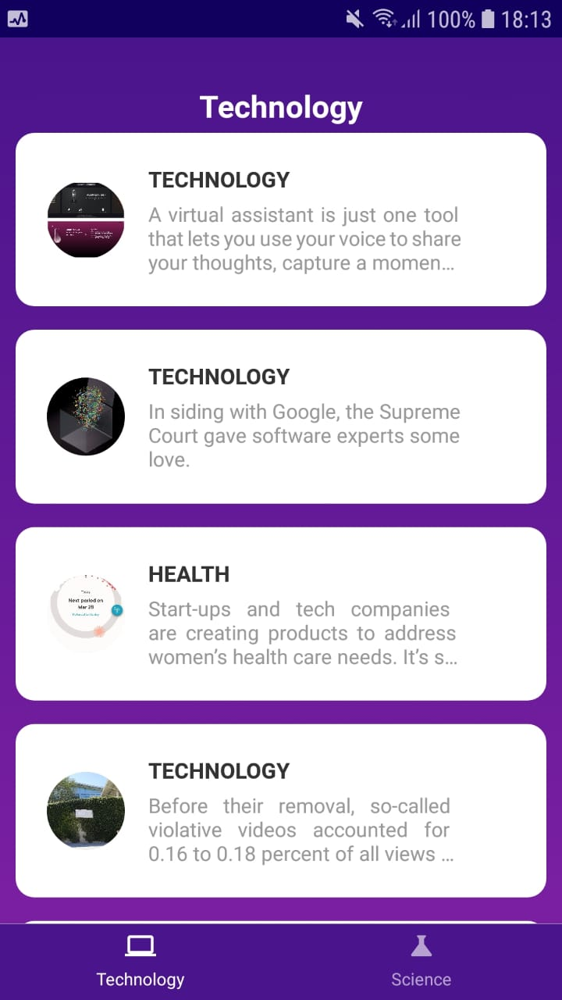
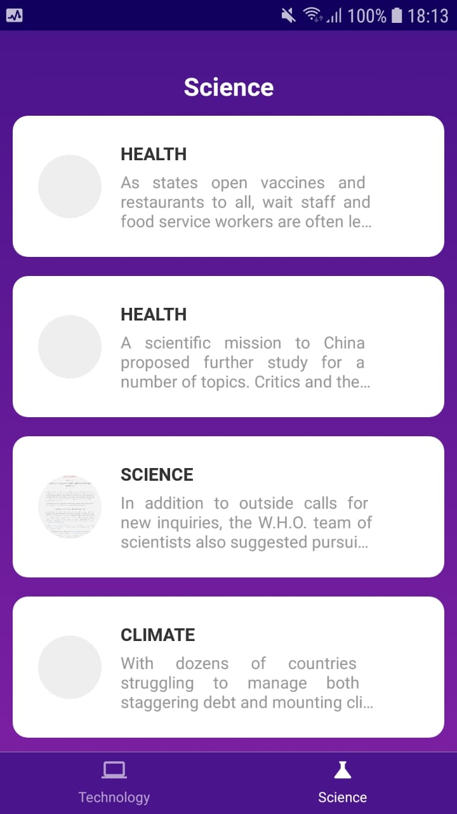

# Technology&Science

## Introdução

A funcionalidade do aplicativo está em consumir uma API [Top Stories](https://developer.nytimes.com/docs/top-stories-product/1/overview)
e listar todas as informações contida na API.

## Screenshots

     

## Components

Componentes utilizados:

- [Text](https://reactnative.dev/docs/text)
- [View](https://reactnative.dev/docs/view)
- [Image](https://reactnative.dev/docs/view)
- [RectButton](https://docs.swmansion.com/react-native-gesture-handler/docs/api/components/buttons)
- [LinearGradient](https://github.com/react-native-linear-gradient/react-native-linear-gradient)
- [ActivityIndicator](https://reactnative.dev/docs/activityindicator)

## Bibliotecas utilizadas

- [Axios](https://github.com/axios/axios)
- [Navigation](https://reactnavigation.org/)
- [React Native Vector Icons](https://github.com/oblador/react-native-vector-icons)
- [Styled Components](https://styled-components.com/)

## Instruções
  * Ao iniciar deve realizar o comando yarn install ou npm install para baixar 
    as bibliotecas  utilizadas.
  * Deve ser criado um arquivo ".env" e adicionar a variavel REACT_APP_API_KEY
    e em seguida inserir o KEY para acessar a API  da [Top Stories](https://developer.nytimes.com/docs/top-stories-product/1/overview).
  * Exemplo: REACT_APP_API_KEY = KEY
